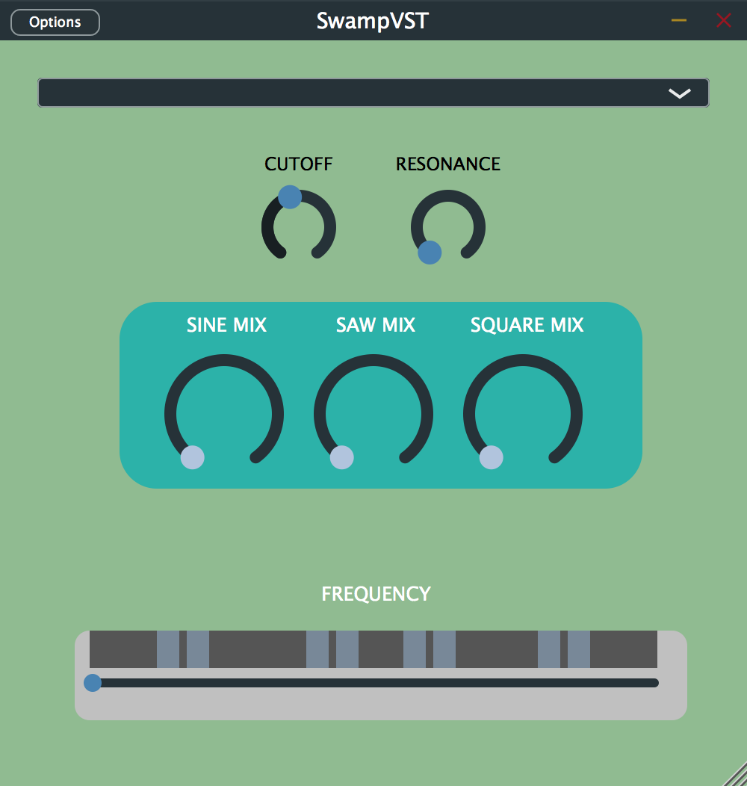

# SwampVST

## About
The SwampVST is intended to be used as a compositional tool within a DAW. The name stemmed from the idea of combining various oscillators (additive synthesis) to sonically craft a swamp of noise. The SwampVST aims to present people with a simple, minimalistic palette to craft audio with, whether it be for music production or sound designing. 
The VST consists of three oscillators- sine, saw and square waves all assigned to rotary sliders. There are also three state variable filters within the VST- lowpass, bandpass, and highpass, which can be shaped with cutoff and resonance rotary sliders.

## How It Works
The VST was written in C++ using Projucer. In order for this project to run, you will need to open it as a stand alone VST. 
As with analog circuitry, signals need to be amplified (or processed in this instance) so that they can be analysed and manipulated, through converting the signal into the appropriate format in order to access the information that it contains. I used the DSP module in Juce to generate the sound of the oscillators within the VST through using algorithms to generate each wave form, which is then converted into audible sound for the user to hear and craft through interacting with the GUI of the VST. 

## GUI Design Considerations 
I wanted to keep the GUI rather minimal and clean, so that it is easy to use. Currently, the GUI isn't what I'd ideally what I'd like it to look like and is aesthetically a lot different than what I'd first pictured; but having no prior experience with GUI design, I am happy with how it looks and feel that it suits the VST well. I feel like the simplicity of the GUI compliments the functionality of the VST, as often the simplest of things promote  creativity. I sought out to use a ribbon-like slider to control the frequency of the oscillators as I wanted to implement a sense of familiarity of hardware ribbon synthesizers.  This idea also came from the Max patch that I created, which used sliders to control the gain blend of each oscillator, which influenced all of the interactive elements of the VST. I chose to use rotary sliders for all of the other components within the VST, as this is reminiscent of knobs on hardware synthesizers to me, which is a type of interaction that feels natural to me. I intentionally made the colour scheme reflect the name of the VST, choosing the colours to reflect the visual nature of a swamp.

## Bugs
The current version of the SwampVST is unable to be opened in Ableton Live — it crashes when placing the VST on an empty MIDI track. This only happened when the state variable filter was added to the VST, so that is a major issue that needs to be solved in order to use the VST within Ableton Live to create music with it. Upon launching the standalone program, the VST automatically plays a 440Hz sine wave — I am yet to figure out how to disable this. The window is resizable, but the oscillator sliders will move with the enlarged window, everything else stays put. There is also an error that pops up when quitting the VST, claiming that the program "quit unexpectedly."

## Future Considerations
Note on/off would be a feature that I'd like to add to the frequency slider, which would be implemented when the slider is clicked and released, turning a note on/off. In conjunction with this, implementing ADSR into the VST would give more control over the envelope of each note, allowing the user to craft the audio more meticulously. A pitch scaling feature, much like what is seen on a lot of other VST's and hardware synth/MIDI controllers, would also be great as it again allows the user to change the range of notes that they are working within. Implementing the possibility of MIDI control for the VST would be something that I'd like to add to the VST.
